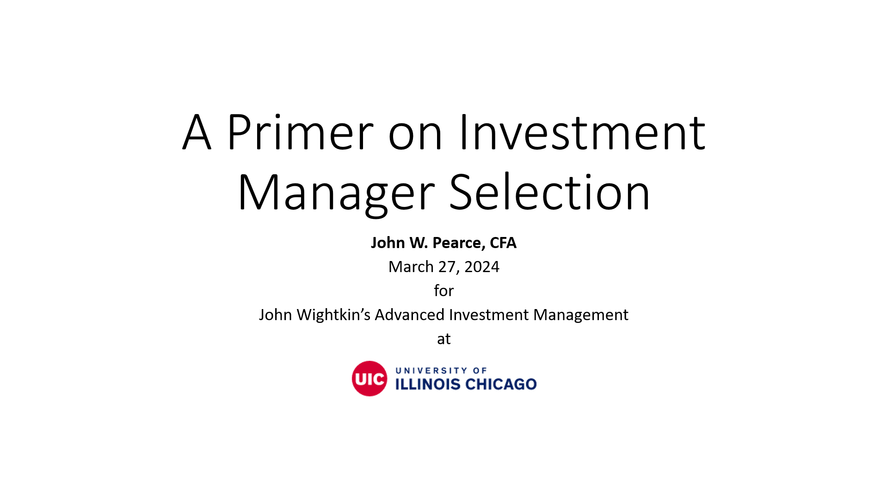

I spoke at John Wightkin's Advanced Investment Management course on March 27, 2024.

I also used used this presentation (or a substantially similar one) for a guest lecture at John Wightkin's Advanced Investment Management course on November 9, 2023.

# Learning Objectives

I.  Build a basic framework for manager selection using a case study
    -   Five (Six?) "Ps"
    -   ICES
II. Discuss the framework in more depth

# Resources

