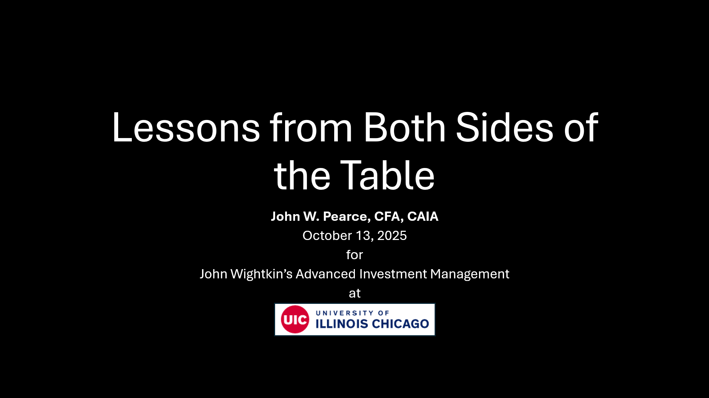

I spoke at both sections of John Wightkin's Advanced Investment Management course on October 13, 2025.

I also used used this presentation (or a substantially similar one) for guest lectures at John Wightkin's Advanced Investment Management course on:

-   March 31, 2025
-   October 16, 2024

# Learning Objectives

I.  What are the "two sides of the table"?
II. How has time at an asset owner helped me see the world differently?
III. What (non-obvious) things did I learn at an asset management firm?

# Resources

