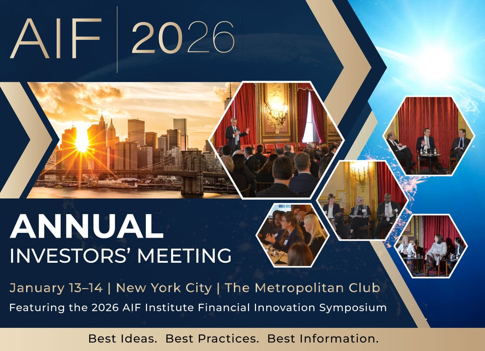

I participated in a roundtable discussion on infrastructure investing at the [AIF Global](https://aifglobal.org/) [Annual Investor's Meeting](https://aifglobal.org/2026-aif-annual-investors-meeting/).

# Discussion Points

-   Evolution and current state of IMRF's Infrastructure Portfolio
-   Why invest in infrastructure at IMRF, and why now?
-   Special considerations for public fund investors in infrastructure

