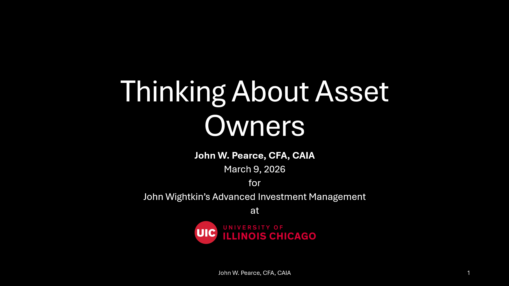

I will be speaking during both sections of John Wightkin's Advanced Investment Management course on March 9, 2026.

# Learning Objectives

I.  Who are "institutional asset owners"?
II. What do pension funds do?
III. Where do asset owners allocate capital?
IV. Why do asset owners hire asset managers?

# Resources

