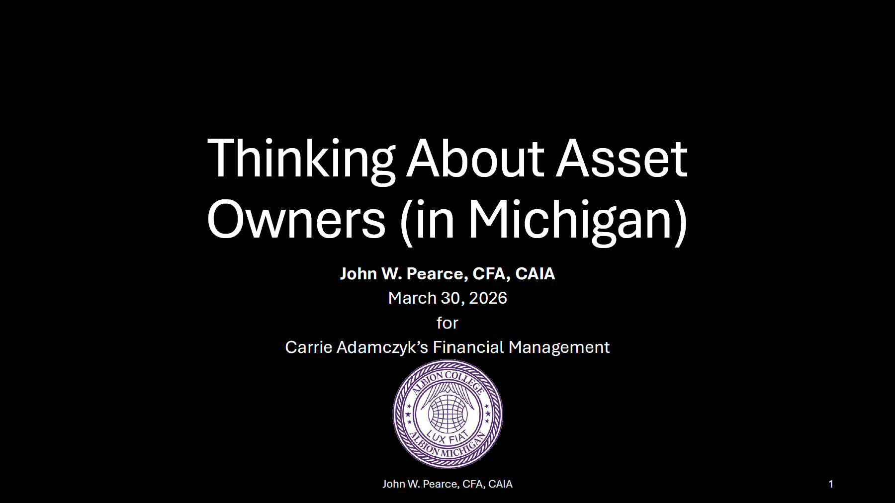

I spoke at Carrie Adamczyk's Financial Management course on March 30, 2026.

# Learning Objectives

I.  Who are "institutional asset owners"?
II. What do pension funds do?
III. Where do asset owners allocate capital?
IV. Why do asset owners hire asset managers?

# Resources

## Links to Discussed Articles and Papers

-   [The Rise of the Total Portfolio Approach](https://caia.org/total-portfolio-approach-2024)
-   [CalPERS Board Adopts TPA](https://www.calpers.ca.gov/newsroom/calpers-news/2025/calpers-board-adopts-streamlined-investment-approach-to-seize-market-opportunities)
-   [Portfolio Design as Gesamtkunstwerk](https://www.alliancebernstein.com/americas/en/institutions/insights/investment-insights/portfolio-design-as-gesamtkunstwerk-the-total-portfolio-approach.html)
-   [Everyone Wants a Pension - Matt Levine](https://www.bloomberg.com/opinion/newsletters/2026-03-03/everyone-wants-a-pension)
-   [Caleb Hammer & Gretchen Whitmer Discuss Michigan Pension Funds](https://www.youtube.com/watch?v=hkzXVJA4Akk&t=1259s)
